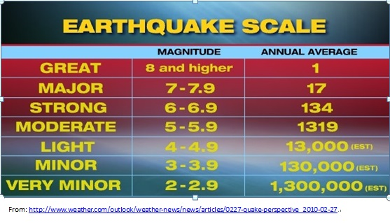
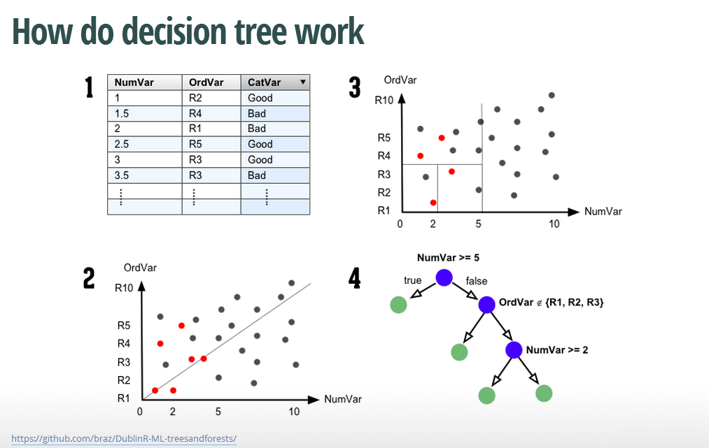

--- .segue .dark 
## Purpose 


---
## 趙藤雄被羈押


---
## 合適購屋站
> - 充斥一堆房價資訊，但每個家庭也都有各自的喜好條件
> - simple model: 可以指定理想房屋型態、條件，可以提供你參考的房價
> - Data source：不動產實價登錄資料 ( ~ 2014年5月16日)
> - Predictor variables : 建物面積、所屬縣市、屋齡、行政區域、建物型態
> - 建物型態: 華廈(10層含以下有電梯)、套房(1房1廳1衛)、公寓(5樓含以下無電梯)、大樓(11層含以上有電梯)


--- .segue .dark 
## Exploratory 

---
## Data Appearance

```r
dat1 <- readRDS("estate_linux.rds")
nrow(dat1)
```

```
[1] 5431
```

```r
head(dat1[sample(1:length(dat1),6),])
```

```
         行政區   縣市 型態     房價 面積 屋齡   車位   管理
9  臺北市文山區 臺北市 公寓  8120000 26.2   31 無車位 有管理
16 臺北市文山區 臺北市 華廈 11800000 24.3   21 無車位 無管理
2  臺北市文山區 臺北市 華廈  8450000 21.8   21 無車位 有管理
5  臺北市中正區 臺北市 華廈 14600000 20.9   38 無車位 無管理
11 臺北市文山區 臺北市 公寓 13500000 25.5   34 無車位 有管理
1  臺北市文山區 臺北市 大樓 47500000 80.5    6 有車位 有管理
```

---

```r
head(dat1[sample(1:length(dat1),20),])
```

```
Error: cannot take a sample larger than the population when 'replace = FALSE'
```


---
## Description 

```r
summary(dat1)
```

```
          行政區          縣市        型態           房價               面積            屋齡     
 桃園縣桃園市: 344   新北市 :1056   公寓: 814   Min.   :5.03e+04   Min.   :  0.3   Min.   : 0.0  
 新北市淡水區: 219   桃園縣 : 978   大樓:2167   1st Qu.:3.55e+06   1st Qu.: 26.2   1st Qu.: 4.0  
 臺中市西屯區: 160   高雄市 : 602   套房: 280   Median :6.30e+06   Median : 35.7   Median :18.0  
 桃園縣楊梅市: 146   臺南市 : 569   華廈: 985   Mean   :9.22e+06   Mean   : 39.7   Mean   :16.9  
 臺北市文山區: 144   臺北市 : 551   透天:1185   3rd Qu.:1.03e+07   3rd Qu.: 48.8   3rd Qu.:25.0  
 桃園縣中壢市: 137   臺中市 : 474               Max.   :1.55e+08   Max.   :232.8   Max.   :74.0  
 (Other)     :4281   (Other):1201                                                                
     車位          管理     
 有車位:2020   有管理:3140  
 無車位:3411   無管理:2291  
                            
                            
                            
                            
                            
```

--- 
## Tabulating

```r
# tabulating
sort(table(dat1[,1]),decreasing = TRUE)[1:5]
```

```

桃園縣桃園市 新北市淡水區 臺中市西屯區 桃園縣楊梅市 臺北市文山區 
         344          219          160          146          144 
```

---
## Formula & Pivot table
- $y \sim x$

```r
# pivotal table
library(reshape);cast(data=dat1,formula=型態 ~ ., fun.aggregate=mean,value="房價")
```

```
  型態    (all)
1 公寓  7007017
2 大樓 12241661
3 套房  3564414
4 華廈  7625996
5 透天  7863983
```

---
## It's your turn 1
- 試練習各縣市在不同型態的房屋數量，如何操作?

```r
library(reshape)
cast(dat1,型態 ~ ., fun.aggregate=mean,value="房價")
```

> - Hint: cast + table

---

```r
# Pivot table (Ans1)
cast(dat1,縣市~.,fun.aggregate=table,value="型態")
```

```
     縣市 公寓 大樓 套房 華廈 透天
1  南投縣    2    3    1    5   29
2  嘉義市    9   33    5   24   47
3  嘉義縣    3    1    0    2   22
4  基隆市   84   33   10   27    7
5  宜蘭縣   11    8   16   34   35
6  屏東縣    9    4    5   12   77
7  彰化縣    8    5    1   15   64
8  新北市  288  493   75  166   34
9  新竹市   12   18    4   21    4
10 新竹縣    4  109    0   38   35
11 桃園縣   73  596   29  181   99
12 澎湖縣    0    0    0    0    1
13 臺中市   41  216   51   79   87
14 臺北市  146  234   47  114   10
15 臺南市   43  104   16  108  298
16 臺東縣    3    0    1    3   20
17 花蓮縣   12    5    5   28   55
18 苗栗縣    9    8    0   49   43
19 金門縣    0    0    0    0    1
20 雲林縣    0    4    0   12   46
21 高雄市   57  293   14   67  171
```

---
## Graphic is more intutive

```r
par(mfrow=c(1,2))
barplot(sort(table(dat1$縣市),decreasing=TRUE)[1:10],las=1,horiz=TRUE)
pie(sort(table(dat1$型態),decreasing=TRUE))
```

<div class="rimage center"></div>

---
## It's your turn 2

```r
par(mfrow=c(1,2))
barplot(sort(table(dat1$縣市),decreasing=TRUE)[1:10],las=1,horiz=TRUE)
pie(sort(table(dat1$型態),decreasing=TRUE))
```
- 1. 按型態的barplot是?
- 2. 前五大縣市的pie plot?

---

```r
# Barplot & Pie plot (Ans2)
par(mfrow=c(1,2))
barplot(sort(table(dat1$型態),decreasing=TRUE),las=1,horiz=TRUE)
pie(sort(table(dat1$縣市),decreasing=TRUE)[1:5])
```

<div class="rimage center"></div>

---
## ggplot (Advanced Visualization)

```r
library(ggplot2);count <- sort(table(dat1$縣市),decreasing=TRUE)[1:10]
zone <- factor(names(count),levels=names(count),ordered=TRUE)
df <- data.frame(count, zone)
ggplot(data=df, aes(x=zone,y=count,fill=zone)) + 
  geom_bar(colour="black",stat="identity") + guides(fill=FALSE)
```

<div class="rimage center"></div>

---
## Histogram  -1

```r
par(mfrow=c(1,2))
hist(dat1$面積,breaks=5,col="lightblue",prob=TRUE,xlab="面積",main="Historgram")
hist(dat1$面積,breaks=100,col="lightgreen",prob=TRUE,xlab="面積",main="Historgram")
```

<div class="rimage center"></div>

---
## Histogram  -2
- http://stackoverflow.com/questions/11530010/how-to-simulate-bimodal-distribution-in-r

```
[1] 2.3
```

```
[1] 5.3
```

```
[1] 0.693
```

```
[1] 1.1
```

```
[1] 0.4
```

<div class="rimage center"></div>

---
## Histogram  -3

```r
par(mfrow=c(1,2))
hist(dat1$房價/10^6,breaks=20,col="lightyellow",prob=TRUE,xlab="房價(百萬)",main="Historgram")
hist(dat1$房價/10^6,breaks=200,col="lightgray",prob=TRUE,xlab="房價(百萬)",main="Historgram")
```

<div class="rimage center"></div>

--- &twocol
## Log transformation for ratio data -1
> - what kind of data: 右偏，如: 芮氏規模地震、分貝、家庭年收入、成本、雨量。
> - even more:  恐怖攻擊造成死亡人數，地震規模每年發生次數。

*** {name: left}

*** {name: right}
<div class="rimage center"></div>

---
## Log transformation for ratio data -2

```r
par(mfrow=c(1,2))
plot(rev(2:8),log10(y),type="l",main="earthquake scale frequency take log")
hist(log10(dat1$面積),breaks=20,col="blue",prob=TRUE,xlab="log10(面積)",main="Historgram")
```

<div class="rimage center"></div>

---
## It's your turn 3

```r
hist(dat1$面積,breaks=100,col="lightgreen",prob=TRUE,xlab="面積",main="Historgram")
hist(log10(dat1$面積),breaks=5,col="blue",prob=TRUE,xlab="log10(面積)",main="Historgram")
```
- 房價(單位百萬)直方圖, log房價(單位百萬)直方圖

> - HINT: 房價單位百萬，寬度調小

---

```r
# Histogram (Ans3)
par(mfrow=c(1,2))
hist(dat1$房價/10^6,breaks=100,col="lightpink",prob=TRUE,xlab="房價(百萬)",main="Historgram")
hist(log10(dat1$房價),breaks=20,col="deeppink",prob=TRUE,xlab="log10(房價)",main="Historgram")
```

<div class="rimage center"></div>

---
## Boxplot 
- median : 中位數            ,  IQR : interquantile range
- range(Q1-1.5IQR,Q3+1.5IQR)  , outlier 

```r
boxplot(面積~型態,data=subset(dat1,縣市=="臺北市"),ylab="面積(坪)",main="面積")
```

<div class="rimage center"></div>

---
## It's your turn 4
- 請繪製有五都("臺北市","新北市","臺中市","高雄市","臺南市") 透天 log10(房價) 和 套房 log10(房價)的boxplot 各一張  

```r
boxplot(面積~型態,data=subset(dat1,縣市=="臺北市"),ylab="面積(坪)",main="面積")
```
- HINT:

```r
dat2 <- dat1[dat1$縣市 %in% c("臺北市","臺中市","新北市","臺南市","高雄市") ,]
dat2$縣市 <- factor(dat2$縣市,levels=c("臺北市","臺中市","新北市","臺南市","高雄市"))
```

---

```r
# Boxplot (Ans4)
dat2 <- dat1[dat1$縣市 %in% c("臺北市","臺中市","新北市","臺南市","高雄市") ,]
dat2$縣市 <- factor(dat2$縣市,levels=c("臺北市","臺中市","新北市","臺南市","高雄市"))
boxplot(log10(房價)~縣市,data=subset(dat2,型態=="透天"),las=2,ylab="log10(房價)",main="透天")
boxplot(log10(房價)~縣市,data=subset(dat2,型態=="套房"),las=2,ylab="log10(房價)",main="套房")
```
<div class="rimage center"></div>

--- .segue .dark 
## Regression

---
## Scatter plot

```r
par(mfrow=c(1,2))
plot(dat1$面積,dat1$房價/10^4,xlab="面積(坪)",ylab="房價(萬元)")
plot(dat1$面積,dat1$房價/10^4,xlab="log面積(坪)",ylab="log房價(萬元)",log="xy")
```

<div class="rimage center"></div>

--- &twocol
## Correlation
*** =left

```r
x <- dat1$面積
y <- dat1$房價/10^4
c(cor(x,y),cor(log10(x),log10(y)))
```

```
[1] 0.544 0.613
```

*** =right
  ## Correlation coefficient by wiki
  
  

--- &twocol
## Be careful to use numeber
- http://en.wikipedia.org/wiki/Anscombe's_quartet

*** =left


*** =right


---
## Simple regression

```r
plot(x,y,xlab="面積(坪)",ylab="房價(萬元)",log="xy")
fit <- lm(log10(y)~log10(x))
abline(fit,col=2,lwd=2)
```

<div class="rimage center"></div>

---
## Variables

- $y$: response ,explained variable, dependent variable, predictand. 如: 房價、雨量
- $x$: predictor, independnet variable... 如: (面積,型態)、(溫度、風速、氣壓)

---

```r
summary(fit)
```

```

Call:
lm(formula = log10(y) ~ log10(x))

Residuals:
    Min      1Q  Median      3Q     Max 
-1.5112 -0.1988 -0.0222  0.1884  1.3239 

Coefficients:
            Estimate Std. Error t value Pr(>|t|)    
(Intercept)   1.2479     0.0274    45.6   <2e-16 ***
log10(x)      1.0032     0.0176    57.1   <2e-16 ***
---
Signif. codes:  0 '***' 0.001 '**' 0.01 '*' 0.05 '.' 0.1 ' ' 1

Residual standard error: 0.3 on 5429 degrees of freedom
Multiple R-squared:  0.375,	Adjusted R-squared:  0.375 
F-statistic: 3.26e+03 on 1 and 5429 DF,  p-value: <2e-16
```

---
## It's your turn 5

```r
x <- dat1$面積
y <- dat1$房價/10^4
c(cor(x,y),cor(log10(x),log10(y)))
plot(x,y,xlab="面積(坪)",ylab="房價(萬元)",log="xy")
fit <- lm(log10(y)~log10(x))
abline(fit,col=2,lwd=2)
```
- 試作 臺北市房價 簡單回歸模型

---


```r
# Simple regression (Ans5)
dat3 <- dat1[dat1$縣市=="臺北市",]
x <- dat3$面積-y <- dat3$房價/10^4
plot(x,y,log="xy");fit<-lm(log10(y)~log10(x))
abline(fit,col=2)
legend("topleft",legend=round(summary(fit)$r.squared,4),title="r.squared")
```

<div class="rimage center"></div>

---
## Multiple regression  - Category variable

```r
library(ggplot2)
dat4 <- dat1
names(dat4) <- c("zone","admin","type","price","area","age","parking","maintance")
qplot(area,price,data=dat4,log="xy") + geom_smooth(method="lm") + facet_grid(parking ~ maintance)
```

<div class="rimage center"></div>

---

```r
m11 <- lm(log10(房價)~log10(面積)+屋齡+型態+車位+管理, data=dat1)
summary(m11)
```

```

Call:
lm(formula = log10(房價) ~ log10(面積) + 屋齡 + 型態 + 
    車位 + 管理, data = dat1)

Residuals:
   Min     1Q Median     3Q    Max 
-1.548 -0.187 -0.031  0.171  1.447 

Coefficients:
             Estimate Std. Error t value Pr(>|t|)    
(Intercept)  5.525369   0.043638  126.62  < 2e-16 ***
log10(面積)  0.975900   0.022462   43.45  < 2e-16 ***
屋齡        -0.002676   0.000428   -6.26  4.2e-10 ***
型態大樓    -0.107572   0.018380   -5.85  5.1e-09 ***
型態套房    -0.081855   0.024657   -3.32  0.00091 ***
型態華廈    -0.185807   0.017072  -10.88  < 2e-16 ***
型態透天    -0.170611   0.014213  -12.00  < 2e-16 ***
車位無車位  -0.067019   0.011182   -5.99  2.2e-09 ***
管理無管理  -0.071261   0.013707   -5.20  2.1e-07 ***
---
Signif. codes:  0 '***' 0.001 '**' 0.01 '*' 0.05 '.' 0.1 ' ' 1

Residual standard error: 0.285 on 5422 degrees of freedom
Multiple R-squared:  0.438,	Adjusted R-squared:  0.437 
F-statistic:  527 on 8 and 5422 DF,  p-value: <2e-16
```

---

```r
m12 <- lm(log10(房價)~log10(面積)+屋齡+型態+車位+管理+行政區, data=dat1)
summary(m12)
```

```

Call:
lm(formula = log10(房價) ~ log10(面積) + 屋齡 + 型態 + 
    車位 + 管理 + 行政區, data = dat1)

Residuals:
    Min      1Q  Median      3Q     Max 
-1.2265 -0.0655  0.0029  0.0750  1.3362 

Coefficients:
                     Estimate Std. Error t value Pr(>|t|)    
(Intercept)           3.80487    0.14266   26.67  < 2e-16 ***
log10(面積)           0.93529    0.01178   79.43  < 2e-16 ***
屋齡                 -0.00407    0.00024  -16.94  < 2e-16 ***
型態大樓              0.03355    0.00963    3.48  0.00050 ***
型態套房             -0.01507    0.01285   -1.17  0.24073    
型態華廈              0.00673    0.00906    0.74  0.45727    
型態透天              0.22132    0.00835   26.52  < 2e-16 ***
車位無車位           -0.04057    0.00583   -6.96  3.9e-12 ***
管理無管理            0.00899    0.00713    1.26  0.20742    
行政區南投縣南投市    1.21450    0.14489    8.38  < 2e-16 ***
行政區南投縣名間鄉    1.10909    0.19932    5.56  2.8e-08 ***
行政區南投縣埔里鎮    1.26090    0.15421    8.18  3.6e-16 ***
行政區南投縣竹山鎮    1.07751    0.16255    6.63  3.7e-11 ***
行政區南投縣草屯鎮    1.30764    0.14766    8.86  < 2e-16 ***
行政區南投縣集集鎮    1.02479    0.17244    5.94  3.0e-09 ***
行政區南投縣魚池鄉    1.22478    0.19908    6.15  8.2e-10 ***
行政區嘉義市嘉義市    1.28298    0.14142    9.07  < 2e-16 ***
行政區嘉義縣中埔鄉    0.99521    0.19908    5.00  6.0e-07 ***
行政區嘉義縣大林鎮    1.21262    0.15430    7.86  4.7e-15 ***
行政區嘉義縣太保市    0.97852    0.16259    6.02  1.9e-09 ***
行政區嘉義縣布袋鎮    0.92141    0.17242    5.34  9.5e-08 ***
行政區嘉義縣朴子市    1.36749    0.17264    7.92  2.9e-15 ***
行政區嘉義縣梅山鄉    1.03431    0.19909    5.20  2.1e-07 ***
行政區嘉義縣民雄鄉    1.02963    0.14704    7.00  2.8e-12 ***
行政區嘉義縣水上鄉    1.01106    0.19911    5.08  4.0e-07 ***
行政區嘉義縣溪口鄉    1.11756    0.19909    5.61  2.1e-08 ***
行政區嘉義縣番路鄉    1.11389    0.19912    5.59  2.3e-08 ***
行政區基隆市七堵區    1.60727    0.14559   11.04  < 2e-16 ***
行政區基隆市中山區    1.36955    0.14624    9.36  < 2e-16 ***
行政區基隆市中正區    1.38544    0.14297    9.69  < 2e-16 ***
行政區基隆市仁愛區    1.51164    0.14667   10.31  < 2e-16 ***
行政區基隆市信義區    1.44002    0.14353   10.03  < 2e-16 ***
行政區基隆市安樂區    1.38243    0.14253    9.70  < 2e-16 ***
行政區基隆市暖暖區    1.38015    0.14501    9.52  < 2e-16 ***
行政區宜蘭縣五結鄉    1.34279    0.15210    8.83  < 2e-16 ***
行政區宜蘭縣冬山鄉    1.31905    0.16264    8.11  6.3e-16 ***
行政區宜蘭縣員山鄉    1.21346    0.15745    7.71  1.5e-14 ***
行政區宜蘭縣壯圍鄉    1.30586    0.19927    6.55  6.2e-11 ***
行政區宜蘭縣宜蘭市    1.47602    0.14333   10.30  < 2e-16 ***
行政區宜蘭縣礁溪鄉    1.55596    0.14424   10.79  < 2e-16 ***
行政區宜蘭縣羅東鎮    1.41966    0.14369    9.88  < 2e-16 ***
行政區宜蘭縣蘇澳鎮    1.12598    0.14614    7.70  1.6e-14 ***
行政區宜蘭縣頭城鎮    1.36602    0.16275    8.39  < 2e-16 ***
行政區屏東縣fa72埔鄉  0.73194    0.19926    3.67  0.00024 ***
行政區屏東縣九如鄉    1.19258    0.15213    7.84  5.5e-15 ***
行政區屏東縣內埔鄉    1.03291    0.15740    6.56  5.8e-11 ***
行政區屏東縣屏東巿    1.24661    0.14224    8.76  < 2e-16 ***
行政區屏東縣恆春鎮    1.37544    0.15741    8.74  < 2e-16 ***
行政區屏東縣新園鄉    0.99315    0.17242    5.76  8.9e-09 ***
行政區屏東縣東港鎮    1.15884    0.15206    7.62  3.0e-14 ***
行政區屏東縣枋寮鄉    0.96904    0.15206    6.37  2.0e-10 ***
行政區屏東縣潮州鎮    1.18399    0.14465    8.19  3.4e-16 ***
行政區屏東縣萬丹鄉    0.94360    0.16259    5.80  6.9e-09 ***
行政區屏東縣里港鄉    0.85990    0.19908    4.32  1.6e-05 ***
行政區屏東縣長治鄉    1.14673    0.15432    7.43  1.3e-13 ***
行政區屏東縣麟洛鄉    1.06494    0.17243    6.18  7.1e-10 ***
行政區彰化縣二林鎮    1.19743    0.15210    7.87  4.2e-15 ***
行政區彰化縣北斗鎮    1.24016    0.15207    8.16  4.3e-16 ***
行政區彰化縣和美鎮    1.29118    0.15206    8.49  < 2e-16 ***
行政區彰化縣員林鎮    1.30863    0.14542    9.00  < 2e-16 ***
行政區彰化縣埔心鄉    1.12881    0.19916    5.67  1.5e-08 ***
行政區彰化縣埤頭鄉    1.28798    0.19909    6.47  1.1e-10 ***
行政區彰化縣彰化市    1.40572    0.14307    9.83  < 2e-16 ***
行政區彰化縣永靖鄉    1.31682    0.16260    8.10  6.9e-16 ***
行政區彰化縣溪湖鎮    1.27766    0.15741    8.12  5.9e-16 ***
行政區彰化縣田中鎮    1.20625    0.15205    7.93  2.6e-15 ***
行政區彰化縣社頭鄉    1.18760    0.17242    6.89  6.3e-12 ***
行政區彰化縣福興鄉    1.35184    0.19923    6.79  1.3e-11 ***
行政區彰化縣秀水鄉    1.14820    0.19909    5.77  8.5e-09 ***
行政區彰化縣線西鄉    1.19819    0.19909    6.02  1.9e-09 ***
行政區彰化縣鹿港鎮    1.32037    0.14843    8.90  < 2e-16 ***
行政區新北市三峽區    1.74821    0.14277   12.25  < 2e-16 ***
行政區新北市三芝區    1.37910    0.15754    8.75  < 2e-16 ***
行政區新北市三重區    1.94138    0.14176   13.69  < 2e-16 ***
行政區新北市中和區    1.98671    0.14160   14.03  < 2e-16 ***
行政區新北市五股區    1.76207    0.14497   12.15  < 2e-16 ***
行政區新北市八里區    1.68688    0.14308   11.79  < 2e-16 ***
行政區新北市土城區    1.90037    0.14297   13.29  < 2e-16 ***
行政區新北市新店區    1.97959    0.14162   13.98  < 2e-16 ***
行政區新北市新莊區    1.88490    0.14174   13.30  < 2e-16 ***
行政區新北市板橋區    2.02355    0.14216   14.23  < 2e-16 ***
行政區新北市林口區    1.70345    0.14296   11.92  < 2e-16 ***
行政區新北市樹林區    1.73515    0.14279   12.15  < 2e-16 ***
行政區新北市永和區    2.08140    0.14266   14.59  < 2e-16 ***
行政區新北市汐止區    1.83000    0.14173   12.91  < 2e-16 ***
行政區新北市泰山區    1.77692    0.14524   12.23  < 2e-16 ***
行政區新北市淡水區    1.67418    0.14125   11.85  < 2e-16 ***
行政區新北市深坑區    1.85535    0.14945   12.41  < 2e-16 ***
行政區新北市蘆洲區    1.88835    0.14224   13.28  < 2e-16 ***
行政區新北市貢寮區    1.09638    0.17251    6.36  2.3e-10 ***
行政區新北市金山區    1.38695    0.19926    6.96  3.8e-12 ***
行政區新北市鶯歌區    1.60284    0.14946   10.72  < 2e-16 ***
行政區新竹市新竹市    1.60420    0.14208   11.29  < 2e-16 ***
行政區新竹縣北埔鄉    1.33200    0.19916    6.69  2.5e-11 ***
行政區新竹縣寶山鄉    1.29187    0.16264    7.94  2.4e-15 ***
行政區新竹縣新埔鎮    1.29452    0.19910    6.50  8.7e-11 ***
行政區新竹縣新豐鄉    1.45958    0.15743    9.27  < 2e-16 ***
行政區新竹縣湖口鄉    1.38228    0.15745    8.78  < 2e-16 ***
行政區新竹縣竹北市    1.58190    0.14146   11.18  < 2e-16 ***
行政區新竹縣竹東鎮    1.31600    0.14297    9.20  < 2e-16 ***
行政區新竹縣關西鎮    1.20839    0.15756    7.67  2.0e-14 ***
行政區桃園縣中壢市    1.53178    0.14137   10.84  < 2e-16 ***
行政區桃園縣八德市    1.52696    0.14161   10.78  < 2e-16 ***
行政區桃園縣大園鄉    1.58943    0.15218   10.44  < 2e-16 ***
行政區桃園縣大溪鎮    1.31441    0.14706    8.94  < 2e-16 ***
行政區桃園縣平鎮市    1.45393    0.14166   10.26  < 2e-16 ***
行政區桃園縣新屋鄉    1.43049    0.19920    7.18  7.9e-13 ***
行政區桃園縣桃園市    1.62606    0.14112   11.52  < 2e-16 ***
行政區桃園縣楊梅市    1.36884    0.14140    9.68  < 2e-16 ***
行政區桃園縣蘆竹鄉    1.66664    0.14163   11.77  < 2e-16 ***
行政區桃園縣觀音鄉    1.30851    0.15426    8.48  < 2e-16 ***
行政區桃園縣龍潭鄉    1.54280    0.17259    8.94  < 2e-16 ***
行政區桃園縣龜山鄉    1.64368    0.14302   11.49  < 2e-16 ***
行政區澎湖縣馬公市    1.28946    0.19909    6.48  1.0e-10 ***
行政區臺中市中區      1.17161    0.15758    7.44  1.2e-13 ***
行政區臺中市南區      1.47641    0.14265   10.35  < 2e-16 ***
行政區臺中市南屯區    1.62406    0.14175   11.46  < 2e-16 ***
行政區臺中市后里區    1.45256    0.19908    7.30  3.4e-13 ***
行政區臺中市外埔區    1.14455    0.19910    5.75  9.5e-09 ***
行政區臺中市大甲區    1.27951    0.15053    8.50  < 2e-16 ***
行政區臺中市大肚區    1.23964    0.19910    6.23  5.2e-10 ***
行政區臺中市大里區    1.36827    0.14767    9.27  < 2e-16 ***
行政區臺中市大雅區    1.48327    0.14769   10.04  < 2e-16 ***
行政區臺中市太平區    1.28724    0.15427    8.34  < 2e-16 ***
行政區臺中市新社區    0.67619    0.19922    3.39  0.00069 ***
行政區臺中市東勢區    1.11756    0.15426    7.24  5.0e-13 ***
行政區臺中市東區      1.38998    0.14775    9.41  < 2e-16 ***
行政區臺中市梧棲區    1.16874    0.15209    7.68  1.8e-14 ***
行政區臺中市沙鹿區    1.36666    0.14429    9.47  < 2e-16 ***
行政區臺中市清水區    1.26441    0.14935    8.47  < 2e-16 ***
行政區臺中市潭子區    1.43562    0.14366    9.99  < 2e-16 ***
行政區臺中市烏日區    1.44294    0.15742    9.17  < 2e-16 ***
行政區臺中市神岡區    1.32592    0.15430    8.59  < 2e-16 ***
行政區臺中市西區      1.55131    0.14257   10.88  < 2e-16 ***
行政區臺中市西屯區    1.60362    0.14134   11.35  < 2e-16 ***
行政區臺中市豐原區    1.52049    0.14431   10.54  < 2e-16 ***
行政區臺中市龍井區    1.16889    0.15757    7.42  1.4e-13 ***
行政區臺北市中山區    2.18641    0.14276   15.31  < 2e-16 ***
行政區臺北市中正區    2.22860    0.14525   15.34  < 2e-16 ***
行政區臺北市信義區    2.20067    0.14369   15.31  < 2e-16 ***
行政區臺北市內湖區    2.08775    0.14202   14.70  < 2e-16 ***
行政區臺北市北投區    2.06299    0.14240   14.49  < 2e-16 ***
行政區臺北市南港區    2.14743    0.14207   15.12  < 2e-16 ***
行政區臺北市士林區    2.10090    0.14208   14.79  < 2e-16 ***
行政區臺北市大同區    2.10301    0.14780   14.23  < 2e-16 ***
行政區臺北市大安區    2.35725    0.14286   16.50  < 2e-16 ***
行政區臺北市文山區    2.01239    0.14143   14.23  < 2e-16 ***
行政區臺北市松山區    2.19700    0.14318   15.34  < 2e-16 ***
行政區臺北市萬華區    2.02262    0.14528   13.92  < 2e-16 ***
行政區臺南市下營區    1.10963    0.19917    5.57  2.7e-08 ***
行政區臺南市中西區    1.41068    0.14517    9.72  < 2e-16 ***
行政區臺南市仁德區    1.30918    0.14382    9.10  < 2e-16 ***
行政區臺南市佳里區    1.16121    0.14544    7.98  1.7e-15 ***
行政區臺南市六甲區    1.03588    0.17242    6.01  2.0e-09 ***
行政區臺南市北區      1.34655    0.14263    9.44  < 2e-16 ***
行政區臺南市北門區    0.99019    0.17243    5.74  9.9e-09 ***
行政區臺南市南區      1.27876    0.14196    9.01  < 2e-16 ***
行政區臺南市善化區    1.21654    0.14937    8.14  4.7e-16 ***
行政區臺南市學甲區    0.99783    0.16257    6.14  9.0e-10 ***
行政區臺南市安南區    1.26885    0.14215    8.93  < 2e-16 ***
行政區臺南市安定區    1.15163    0.19910    5.78  7.7e-09 ***
行政區臺南市安平區    1.32628    0.14319    9.26  < 2e-16 ***
行政區臺南市官田區    0.98203    0.15426    6.37  2.1e-10 ***
行政區臺南市新化區    1.25457    0.17246    7.27  4.0e-13 ***
行政區臺南市新市區    1.27702    0.16258    7.85  4.8e-15 ***
行政區臺南市新營區    1.21209    0.14385    8.43  < 2e-16 ***
行政區臺南市東區      1.41559    0.14162   10.00  < 2e-16 ***
行政區臺南市柳營區    0.93406    0.16259    5.74  9.7e-09 ***
行政區臺南市楠西區    0.92615    0.19910    4.65  3.4e-06 ***
行政區臺南市歸仁區    1.26333    0.14298    8.84  < 2e-16 ***
行政區臺南市永康區    1.31159    0.14135    9.28  < 2e-16 ***
行政區臺南市白河區    1.24390    0.16259    7.65  2.4e-14 ***
行政區臺南市西港區    1.11577    0.15056    7.41  1.5e-13 ***
行政區臺南市關廟區    0.99513    0.17242    5.77  8.3e-09 ***
行政區臺南市鹽水區    0.98108    0.17257    5.69  1.4e-08 ***
行政區臺南市麻豆區    1.21891    0.15423    7.90  3.3e-15 ***
行政區臺東縣台東市    1.25913    0.14369    8.76  < 2e-16 ***
行政區臺東縣太麻里鄉  1.19121    0.19942    5.97  2.5e-09 ***
行政區臺東縣成功鎮    0.63540    0.19909    3.19  0.00142 ** 
行政區臺東縣鹿野鄉    1.03906    0.19908    5.22  1.9e-07 ***
行政區花蓮縣光復鄉    0.91894    0.17243    5.33  1.0e-07 ***
行政區花蓮縣吉安鄉    1.35874    0.14609    9.30  < 2e-16 ***
行政區花蓮縣壽豐鄉    1.27781    0.17251    7.41  1.5e-13 ***
行政區花蓮縣新城鄉    1.18262    0.15422    7.67  2.1e-14 ***
行政區花蓮縣玉里鎮    1.13782    0.15052    7.56  4.8e-14 ***
行政區花蓮縣花蓮市    1.40234    0.14178    9.89  < 2e-16 ***
行政區花蓮縣鳳林鎮    1.15810    0.17251    6.71  2.1e-11 ***
行政區苗栗縣公館鄉    1.21566    0.17245    7.05  2.0e-12 ***
行政區苗栗縣卓蘭鎮    1.21373    0.19909    6.10  1.2e-09 ***
行政區苗栗縣大湖鄉    1.14326    0.17243    6.63  3.7e-11 ***
行政區苗栗縣竹南鎮    1.38035    0.14415    9.58  < 2e-16 ***
行政區苗栗縣苑裡鎮    1.33164    0.17246    7.72  1.4e-14 ***
行政區苗栗縣苗栗市    1.24212    0.14575    8.52  < 2e-16 ***
行政區苗栗縣頭份鎮    1.41037    0.14206    9.93  < 2e-16 ***
行政區苗栗縣頭屋鄉    1.13281    0.15433    7.34  2.5e-13 ***
行政區金門縣金城鎮    1.36410    0.19908    6.85  8.1e-12 ***
行政區雲林縣元長鄉    0.77865    0.19909    3.91  9.3e-05 ***
行政區雲林縣北港鎮    1.20236    0.15209    7.91  3.2e-15 ***
行政區雲林縣古坑鄉    1.04791    0.19909    5.26  1.5e-07 ***
行政區雲林縣土庫鎮    1.14720    0.19917    5.76  8.9e-09 ***
行政區雲林縣斗六市    1.35226    0.14412    9.38  < 2e-16 ***
行政區雲林縣斗南鎮    1.12629    0.14934    7.54  5.4e-14 ***
行政區雲林縣東勢鄉    0.94042    0.19909    4.72  2.4e-06 ***
行政區雲林縣林內鄉    0.96092    0.17241    5.57  2.6e-08 ***
行政區雲林縣莿桐鄉    1.00360    0.17242    5.82  6.2e-09 ***
行政區雲林縣虎尾鎮    1.21436    0.14711    8.25  < 2e-16 ***
行政區雲林縣西螺鎮    1.14171    0.15052    7.59  3.9e-14 ***
行政區雲林縣麥寮鄉    1.23140    0.19929    6.18  6.9e-10 ***
行政區高雄市三民區    1.47642    0.14253   10.36  < 2e-16 ***
行政區高雄市仁武區    1.24945    0.14936    8.37  < 2e-16 ***
行政區高雄市前金區    1.55237    0.16277    9.54  < 2e-16 ***
行政區高雄市前鎮區    1.44309    0.14241   10.13  < 2e-16 ***
行政區高雄市大寮區    1.18670    0.14269    8.32  < 2e-16 ***
行政區高雄市大樹區    1.00413    0.15215    6.60  4.5e-11 ***
行政區高雄市大社區    1.18890    0.15428    7.71  1.5e-14 ***
行政區高雄市小港區    1.36885    0.14236    9.62  < 2e-16 ***
行政區高雄市岡山區    1.34773    0.14517    9.28  < 2e-16 ***
行政區高雄市左營區    1.53689    0.14183   10.84  < 2e-16 ***
行政區高雄市彌陀區    1.23260    0.19917    6.19  6.5e-10 ***
行政區高雄市新興區    1.35690    0.19936    6.81  1.1e-11 ***
行政區高雄市旗山區    1.22739    0.15739    7.80  7.5e-15 ***
行政區高雄市林園區    1.02068    0.14653    6.97  3.7e-12 ***
行政區高雄市梓官區    1.19208    0.19909    5.99  2.3e-09 ***
行政區高雄市楠梓區    1.40107    0.14173    9.89  < 2e-16 ***
行政區高雄市橋頭區    1.30978    0.17241    7.60  3.6e-14 ***
行政區高雄市湖內區    1.13532    0.14513    7.82  6.2e-15 ***
行政區高雄市燕巢區    1.25341    0.16258    7.71  1.5e-14 ***
行政區高雄市苓雅區    1.63185    0.14716   11.09  < 2e-16 ***
行政區高雄市茄萣區    0.98264    0.17248    5.70  1.3e-08 ***
行政區高雄市路竹區    1.22240    0.15742    7.77  9.8e-15 ***
行政區高雄市阿蓮區    1.18073    0.15741    7.50  7.4e-14 ***
行政區高雄市鳥松區    1.38566    0.14712    9.42  < 2e-16 ***
行政區高雄市鳳山區    1.37689    0.14152    9.73  < 2e-16 ***
行政區高雄市鹽埕區    1.56994    0.17256    9.10  < 2e-16 ***
行政區高雄市鼓山區    1.67786    0.14228   11.79  < 2e-16 ***
---
Signif. codes:  0 '***' 0.001 '**' 0.01 '*' 0.05 '.' 0.1 ' ' 1

Residual standard error: 0.141 on 5196 degrees of freedom
Multiple R-squared:  0.868,	Adjusted R-squared:  0.862 
F-statistic:  146 on 234 and 5196 DF,  p-value: <2e-16
```

---
## It's your turn 6 

```r
m11 <- lm(log10(房價)~log10(面積)+屋齡+型態+車位+管理, data=dat1);summary(m11)
m12 <- lm(log10(房價)~log10(面積)+屋齡+型態+車位+管理+行政區, data=dat1)
```
- 試建立臺北市 multiple regression(predictor: +行政區)，並找出R.squared

---

```r
# Multiple regression & category variable-1 (Ans6)-1
m21 <- lm(log10(房價)~log10(面積)+屋齡+型態+車位+管理, data=dat3)
m22 <- lm(log10(房價)~log10(面積)+屋齡+型態+車位+管理+行政區, data=dat3)
# R-squared, 越趨近1模型解釋能力越好
data.frame("model.taiwan.1"=summary(m11)$r.sq, "model.taiwan.all"=summary(m12)$r.sq, 
           "model.taipei.1"=summary(m21)$r.sq, "model.taipei.all"=summary(m22)$r.sq)
```

```
  model.taiwan.1 model.taiwan.all model.taipei.1 model.taipei.all
1          0.438            0.868          0.746            0.805
```

---

```r
summary(m21)
```

```

Call:
lm(formula = log10(房價) ~ log10(面積) + 屋齡 + 型態 + 
    車位 + 管理, data = dat3)

Residuals:
    Min      1Q  Median      3Q     Max 
-0.7310 -0.0657 -0.0034  0.0928  0.6235 

Coefficients:
             Estimate Std. Error t value Pr(>|t|)    
(Intercept)  5.538797   0.072393   76.51  < 2e-16 ***
log10(面積)  1.115329   0.039894   27.96  < 2e-16 ***
屋齡        -0.002501   0.000888   -2.82  0.00503 ** 
型態大樓     0.058973   0.030865    1.91  0.05658 .  
型態套房     0.118842   0.037591    3.16  0.00166 ** 
型態華廈     0.095532   0.026585    3.59  0.00036 ***
型態透天    -0.010588   0.056057   -0.19  0.85025    
車位無車位   0.058145   0.023843    2.44  0.01506 *  
管理無管理  -0.038134   0.023876   -1.60  0.11081    
---
Signif. codes:  0 '***' 0.001 '**' 0.01 '*' 0.05 '.' 0.1 ' ' 1

Residual standard error: 0.168 on 542 degrees of freedom
Multiple R-squared:  0.746,	Adjusted R-squared:  0.742 
F-statistic:  199 on 8 and 542 DF,  p-value: <2e-16
```

---

```r
summary(m22)
```

```

Call:
lm(formula = log10(房價) ~ log10(面積) + 屋齡 + 型態 + 
    車位 + 管理 + 行政區, data = dat3)

Residuals:
    Min      1Q  Median      3Q     Max 
-0.7357 -0.0495  0.0207  0.0762  0.5084 

Coefficients:
                    Estimate Std. Error t value Pr(>|t|)    
(Intercept)         5.694035   0.072704   78.32  < 2e-16 ***
log10(面積)         1.099274   0.037002   29.71  < 2e-16 ***
屋齡               -0.003837   0.000834   -4.60  5.3e-06 ***
型態大樓            0.028766   0.027957    1.03   0.3040    
型態套房            0.069702   0.034085    2.04   0.0414 *  
型態華廈            0.030078   0.024477    1.23   0.2197    
型態透天            0.007296   0.050197    0.15   0.8845    
車位無車位          0.028909   0.021389    1.35   0.1771    
管理無管理         -0.030607   0.021491   -1.42   0.1550    
行政區臺北市中正區  0.062425   0.044690    1.40   0.1630    
行政區臺北市信義區  0.024041   0.038577    0.62   0.5334    
行政區臺北市內湖區 -0.080093   0.031068   -2.58   0.0102 *  
行政區臺北市北投區 -0.100074   0.032903   -3.04   0.0025 ** 
行政區臺北市南港區 -0.043642   0.033443   -1.30   0.1925    
行政區臺北市士林區 -0.081344   0.031162   -2.61   0.0093 ** 
行政區臺北市大同區 -0.093133   0.053005   -1.76   0.0795 .  
行政區臺北市大安區  0.166080   0.034852    4.77  2.4e-06 ***
行政區臺北市文山區 -0.155161   0.029398   -5.28  1.9e-07 ***
行政區臺北市松山區 -0.003119   0.036284   -0.09   0.9315    
行政區臺北市萬華區 -0.135424   0.045177   -3.00   0.0028 ** 
---
Signif. codes:  0 '***' 0.001 '**' 0.01 '*' 0.05 '.' 0.1 ' ' 1

Residual standard error: 0.148 on 531 degrees of freedom
Multiple R-squared:  0.805,	Adjusted R-squared:  0.798 
F-statistic:  115 on 19 and 531 DF,  p-value: <2e-16
```

---

```r
forecast <- dat1[1:5, c(1,2,3,5,6,7,8)];rownames(forecast) <- 1:5
forecast$面積 <- c(30,30,8,40,40)
forecast$行政區 <- c("萬華區","大安區","信義區","中山區","南港區")
forecast$行政區 <- paste("臺北市",forecast$行政區,sep="")
forecast$屋齡 <- c(30,6,6,8,8)
forecast$車位 <- c("無車位","有車位","無車位","有車位","有車位")
forecast$管理 <- c("無管理","有管理","無管理","有管理","有管理")
forecast$型態 <- c("公寓","大樓","套房","大樓","透天")
# prediction with m12: log10(房價)~log10(面積)+屋齡+型態+車位+管理+行政區
tmp <- predict(m12, newdata=forecast, se.fit=TRUE)
pred <- 10^cbind(tmp$fit, tmp$fit-tmp$se.fit, tmp$fit+tmp$se.fit)
data.frame("建案坪數"=forecast$面積, "建物型態"=forecast$型態, 
           "總價估計.萬元"=round(pred[,1]/10000),"單價估計.萬元"=round(pred[,1]/10000/forecast$面積))
```

```
  建案坪數 建物型態 總價估計.萬元 單價估計.萬元
1       30     公寓          1136            38
2       30     大樓          3571           119
3        8     套房           601            75
4       40     大樓          3095            77
5       40     透天          4360           109
```

---
## It's your trun 7

```r
forecast <- dat1[1:5, c(1,2,3,5,6,7,8)];rownames(forecast) <- 1:5
forecast$面積 <- c(30,30,8,40,40)
forecast$行政區 <- c("萬華區","大安區","信義區","中山區","南港區")
forecast$行政區 <- paste("臺北市",forecast$行政區,sep="")
forecast$屋齡 <- c(30,6,6,8,8)
forecast$車位 <- c("無車位","有車位","無車位","有車位","有車位")
forecast$管理 <- c("無管理","有管理","無管理","有管理","有管理")
forecast$型態 <- c("公寓","大樓","套房","大樓","透天")
# prediction with m12: log10(房價)~log10(面積)+屋齡+型態+車位+管理+行政區
tmp <- predict(m12, newdata=forecast, se.fit=TRUE)
pred <- 10^cbind(tmp$fit, tmp$fit-tmp$se.fit, tmp$fit+tmp$se.fit)
data.frame("建案坪數"=forecast$面積, "建物型態"=forecast$型態, 
           "總價估計.萬元"=round(pred[,1]/10000),"單價估計.萬元"=round(pred[,1]/10000/forecast$面積))
```
- 試練習直接使用臺北市資料所建立之模型，作以上預測。

---

```r
forecast <- dat3[1:5, c(1,3,5,6,7,8)];rownames(forecast) <- 1:5
forecast$面積 <- c(30,30,8,40,40)
forecast$行政區 <- c("萬華區","大安區","信義區","中山區","南港區")
forecast$行政區 <- paste("臺北市",forecast$行政區,sep="")
forecast$屋齡 <- c(30,6,6,8,8)
forecast$車位 <- c("無車位","有車位","無車位","有車位","有車位")
forecast$管理 <- c("無管理","有管理","無管理","有管理","有管理")
forecast$型態 <- c("公寓","大樓","套房","大樓","透天")
# prediction
tmp <- predict(m22, newdata=forecast, se.fit=TRUE)
pred <- 10^cbind(tmp$fit, tmp$fit-tmp$se.fit, tmp$fit+tmp$se.fit)
data.frame("建案坪數"=forecast$面積, "建物型態"=forecast$型態, 
           "總價估計.萬元"=round(pred[,1]/10000),"單價估計.萬元"=round(pred[,1]/10000/forecast$面積))
```

```
  建案坪數 建物型態 總價估計.萬元 單價估計.萬元
1       30     公寓          1163            39
2       30     大樓          3088           103
3        8     套房           570            71
4       40     大樓          2839            71
5       40     透天          2444            61
```

---
## extension studies

--- .segue .dark 
## Dicision Tree

---


---
## Dicision Tree

```r
library(rpart)
dat3$房價百萬 <- dat3$房價/10^6
fit <- rpart(型態~面積+車位+管理+屋齡+房價百萬,data=dat3)
library(rpart.plot)
prp(fit,extra=1,col=2,box.col="lightgray",shadow.col="gray")
```

<div class="rimage center"></div>

---
## It's your turn 8

```r
library(rpart)
dat3$房價百萬 <- dat3$房價/10^6
fit <- rpart(型態~面積+車位+管理+屋齡+房價百萬,data=dat3)
library(rpart.plot)
prp(fit,extra=1)
```
- 試練習五都 Disicion Tree

---
## Dicision Tree (Ans8)

```r
dat2$房價百萬 <- dat2$房價/10^6
fit2 <- rpart(縣市~型態+面積+屋齡+房價百萬,data=dat2)
prp(fit2,extra=1,col=2,box.col="lightgray",shadow.col="gray")
```

<div class="rimage center"></div>

---
## extension studies


--- .segue .dark 
## Future

---
## 進階課程內容
* GAM(Generalized Additive Model): nonlinear parameter for nonlinear model
  * 進階模型配適
* Overfitting:
  * 模型是否預測準確? (Cross Validation, model selection critera)

* Evaluation: 
  * 校驗模型準確性(RMSE,MAE,Recall & Recall)

---
## Reference

- 背後巨人: https://github.com/JohnsonHsieh
- 
-


---
# non-linear coefficent(補充)

---
## GAM model

```r
library(mgcv) # provides functions for generalized additive modelling
# fit linear model
m31 <- lm(log10(房價)~log10(面積)+車位+屋齡+型態+行政區, data=dat1)
# fit addiive model with two smooth terms
m32 <- gam(log10(房價)~s(log10(面積))+車位+s(屋齡)+型態+行政區, data=dat1)

# Compare adjusted R-squared, 越趨近1模型配適度越好
data.frame("linear model"=summary(m31)$r.sq,"additive model"=summary(m32)$r.sq)
```

```
  linear.model additive.model
1        0.868          0.872
```

---
## GAM model parameter : smoothing parameter

```r
par(cex=1.2, mfrow=c(1,2))
plot(m32, select=1, lwd=2) 
abline(h=m31$coefficients[["log10(面積)"]], lwd=2, col=2)
legend("topleft", c("Smooth term", "Linear term"), col=1:2, lty=1, lwd=2, bty="n")
plot(m32, select=2, lwd=2)
abline(h=m31$coefficients[["屋齡"]], lwd=2, col=2)
```

<div class="rimage center"></div>

---
## Compare Multiple regression and GAM model Answer

```r
library(mgcv) # provides functions for generalized additive modelling
# fit linear model
m_new1 <- lm(log10(房價)~面積+車位+屋齡+型態+行政區+縣市, data=dat1)
# fit addiive model with two smooth terms
m_new2 <- gam(log10(房價)~s(log10(面積))+車位+s(屋齡)+型態+行政區+縣市, data=dat1)
# Compare adjusted R-squared, 越趨近1模型配適度越好
data.frame("linear model"=summary(m_new1)$adj.r.sq, "additive model"=summary(m_new2)$r.sq)
```

```
  linear.model additive.model
1        0.832          0.872
```

---
## It's your turn 7+1

```r
library(mgcv) # provides functions for generalized additive modelling
# fit linear model
m_new1 <- lm(log10(房價)~面積+車位+屋齡+型態+行政區+縣市, data=dat1)
# fit addiive model with two smooth terms
m_new2 <- gam(log10(房價)~s(面積)+車位+s(屋齡)+型態+行政區+縣市, data=dat1)
# Compare adjusted R-squared, 越趨近1模型配適度越好
data.frame("linear model"=summary(m_new1)$adj.r.sq, "additive model"=summary(m_new2)$r.sq)
```
- 試比較臺北市lm與gam模型，參數同上

---
## Multiple regression & GAM (Ans7+1)

```r
library(mgcv) # provides functions for generalized additive modelling
# fit linear model
m_new1_taip <- lm(log10(房價)~面積+車位+屋齡+型態+行政區, data=dat3)
# fit addiive model with two smooth terms
m_new2_taip <- gam(log10(房價)~s(log10(面積))+車位+s(屋齡)+型態+行政區, data=dat3)
# Compare adjusted R-squared, 越趨近1模型配適度越好
data.frame("linear model"=summary(m_new1_taip)$adj.r.sq, "additive model"=summary(m_new2_taip)$r.sq)
```

```
  linear.model additive.model
1        0.763          0.811
```


